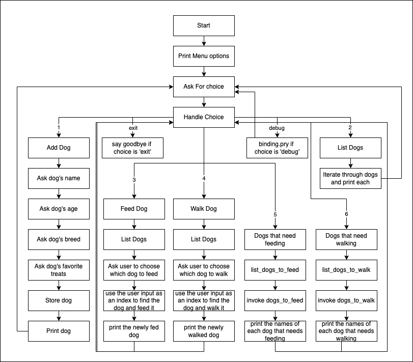

# Object Oriented Ruby Continued

## Key Concepts for the day:

- Mass assignment, keyword arguments
- Class methods vs Instance methods
- How to use the `self` keyword and identify what it will refer to
- Class variables vs Instance variables
- Private methods

The methods we'll be working on today are related to persisting and retrieving Dogs. These are important tasks that we'll continue to do as we introduce new concepts like databases and ActiveRecord later on in the week. The lectures coming up over the next few days will be introducing variations on the same themes. You'll be seeing how the new concepts apply to the applications we've been working on throughout the phase.

## Keyword Arguments & Mass Assignment

This is what our initialize method looks like currently:

```rb
class Dog
  attr_accessor :name, :age, :breed, :image_url
  def initialize(name, age, breed, image_url)
    @name = name
    @age = age
    @breed = breed
    @image_url = image_url
  end
end
```

And creating a new instance looks like this:

```rb
dog = Dog.new("Lennon Snow", "1 year", "Pomeranian", "https://res.cloudinary.com/dnocv6uwb/image/upload/v1609370267/dakota-and-lennon-square-compressed_hoenfo.jpg")
```

There are a couple of downsides to this approach. 

1. We have to remember the proper order of the arguments or we'll get values assigned to the wrong attributes. 

2. We can't tell from the calling code (where we have `.new`) what the attributes are, which means we're probably going to have to look at that initialize method to see what's going on there.

Using keyword arguments instead will solve both of these problems:

```rb
class Dog
  attr_accessor :name, :age, :breed, :image_url
  def initialize(name:, age:, breed:, image_url:)
    @name = name
    @age = age
    @breed = breed
    @image_url = image_url
  end
end
```

Run 

```bash
./bin/keyword_arguments_demo
```

to test this out

```rb
Dog.new(name: "Lennon Snow", breed: "Pomeranian", image_url: "https://res.cloudinary.com/dnocv6uwb/image/upload/v1609370267/dakota-and-lennon-square-compressed_hoenfo.jpg", age: "1 year")
```

Notice I've switched up the order that the attributes appear within the call to `.new`. This doesn't matter when we're using keyword arguments because the keyword ensures that the attribute values are stored in the appropriate place. When using keyword arguments, all keywords are required by default, so if we try to skip one, we'll get an ArgumentError 


```rb
Dog.new(name: "Lennon Snow", breed: "Pomeranian", image_url: "https://res.cloudinary.com/dnocv6uwb/image/upload/v1609370267/dakota-and-lennon-square-compressed_hoenfo.jpg")
Traceback (most recent call last):
        6: from /Users/dakotamartinez/.rvm/rubies/ruby-2.6.6/bin/irb:23:in `<main>'
        5: from /Users/dakotamartinez/.rvm/rubies/ruby-2.6.6/bin/irb:23:in `load'
        4: from /Users/dakotamartinez/.rvm/rubies/ruby-2.6.6/lib/ruby/gems/2.6.0/gems/irb-1.0.0/exe/irb:11:in `<top (required)>'
        3: from (irb):10
        2: from (irb):10:in `new'
        1: from (irb):2:in `initialize'
ArgumentError (missing keyword: age)
```

Even this error message is more helpful than the ArgumentError we'd get if we failed to pass a 4th argument. 

I'm going to take a brief moment to introduce one of the limitations of keyword arguments and discuss an alternative solution that is similar to what actually happens in the library you'll be using to handle behavior like this from the end of the week moving forward. If we want to allow more flexibility, but still allow the mass assignment of attribute values, we can use some metaprogramming to do it.

```rb
class Dog 
  attr_accessor :name, :age, :breed, :image_url
  def initialize(attributes = {})
    attributes.each do |attr, value|
      self.send("#{attr}=", value)
    end
  end
end
```

Test this one with 

```bash
./bin/metaprogramming_demo
```

And try the following:

```rb
# all will work
Dog.new(name: "Lennon Snow", breed: "Pomeranian", image_url: "https://res.cloudinary.com/dnocv6uwb/image/upload/v1609370267/dakota-and-lennon-square-compressed_hoenfo.jpg", age: "1 year")
Dog.new
Dog.new(name: "Lennon Snow")
```

This approach will allow us to pass a collection of key value pairs when we create a new dog and as long as each key corresponds to a setter method that exists within the Dog class, it'll work without an error. We can pass as many key value pairs as we like with this approach without triggering an ArgumentError. Being able to write the code above from scratch is much less important than understanding the implications of this approach. 

When you start using ActiveRecord later on in this phase, it'll sometimes be useful to keep in mind that something akin to this pattern is happening under the hood whenever you create a new instance of one of your ActiveRecord models. We'll be referring back to this pattern as we move forward, so we'll have a chance to review these ideas again later on.

## Introducing Class Methods

The main problem we're going to focus on today is how to keep track of multiple instances of the same class. 

- Instance methods require an instance to be of any use
- What if we want to have a method in the class that we can call without needing an instance first?
- For those cases, we need a class method.

Here are some examples of class methods we might want:

- `.all` - returns all of the instances we've created.
- `.create` - makes a new instance and persists it.
- `.find_by_name(name)` takes a name as an argument and returns the instance that has that name.
- `.by_breed(breed)` takes a breed as an argument and returns an array of all pets that share that breed.
- `.hungry` returns an array of all dogs that need feeding.
- `.needs_walking` returns an array of all dogs that need walking.

### Class methods vs Instance methods & self

#### Class methods are:
  - Defined **on** the class
  - Called **on** the class
  - and `self` refers to the class
#### Instance methods are:
  - Defined with**in** the class (but not *ON* it)
  - Called on an **in**stance of the class
  - and `self` refers to the **in**stance

### examples

```rb
class Dog
  puts "Inside the Dog class, self is: #{self}"

  @@all = []

  def self.all
    puts "Inside a class method in the Dog class, self is: #{self}"
    @@all
  end

  attr_accessor :name

  def initialize(name)
    self.name = name
  end

  def say_hi
    puts "Inside an instance method in the Dog class, self is: #{self}"
    puts "Hi there, I'm #{self.name}"
  end
end
```

I've got this class defined within `bin/test` which you can run using the following command:

```bash
./bin/class_and_instace_methods_demo
```

Once we do that, we can see:

```rb
% ./bin/test
Inside the Dog class, self is: Dog
[1] pry(main)> Dog.all
Inside a class method in the Dog class, self is: Dog
=> []
[2] pry(main)> dog = Dog.new("Lennon")
=> #<Dog:0x00007ff4e60bd488 @name="Lennon">
[3] pry(main)> dog.say_hi
Inside an instance method in the Dog class, self is: #<Dog:0x00007ff4e60bd488>
Hi there, I'm Lennon
=> nil
```

We can tell that `.all` is a class method in 2 main ways from looking at code. 

1. The `.all` method is **defined** on `self` within the class (and `self` will be the class within the class)
2. The `.all` method is **called** on `Dog` in the pry, which also tells us that `.all` must be a class method.

Similarly, we can tell that `say_hi` is an instance method in 2 main ways from looking at the code:

1. The `say_hi` method is **defined within but not *ON*** the class.
2. The `say_hi` method is called upon an **instance** of the class (not the class itself)

> When it comes to deciding whether a method should be a class method or an instance method, the main determining factor is how you plan to call the method. Will you call it directly **on the class**? If so-make it a **class** method. Will you call it **on an instance** of the class? If so-make it an **instance** method
## Dog Walker CLI Part 3
### Key Features we're going to add to our Dog Walker CLI:

- Add the ability to view all dogs that need feeding
- Add the ability to view all dogs that need walking

### Key Refactors for Dog Walker CLI

- Dog class
  - refactor initialize method to use keyword arguments.
  - add a `.all` method and `@@all` class variable to keep track of all the dogs
  - add a `#save` method that will save an instance of the dog class to `@@all`
  - add a `.create(attributes)` method that take attributes as an argument and will instantiate and save a new instance of the dog class.
  - add a `.hungry` method that returns an array of all dogs that need feeding.
  - add a `.needs_walking` method that returns an array of all dogs that need walking.
  
- In CLI
  - Add menu options for viewing all dogs that need feeding and all dogs that need walking.
  - rework the parts of the cli that were expecting to find all of our dogs in `$dogs` to use the `Dog.all` method instead.
    - we'll use `Dog.all` instead of `$dogs` to access the array of Dog instances
    - within the `add_dog` method, we'll create an instance of the `Dog` class using the `.create` method

- In dogs_data
  - We'll remove the call to `.map` at the end of the file so that `$dogs` is an array of hashes containing dog info again.

- In bin/run
  - We'll use `$dogs` and some of our new methods from `Dog` to create and save dogs from the `lib/dogs_data.rb` file

### Logistics

- The code for our cli will be written in the file `lib/dog_walker_cli.rb`. 
- Our class methods will be written in `lib/dog.rb` where our `Dog` class is defined.
- Again, we'll start our cli application by running the following command in our terminal:

```bash
./bin/run
```

Here's a sketch of the flow of the program we're going to create:



## NOTE

You may need to use the `chmod` command to make the demo files executable on your machine. If so, you'll run these commands from the `demo` directory in your terminal:

```bash
chmod +x ./bin/class_and_instance_methods_demo
chmod +x ./bin/keyword_arguments_demo
chmod +x ./bin/metaprogramming_demo
```